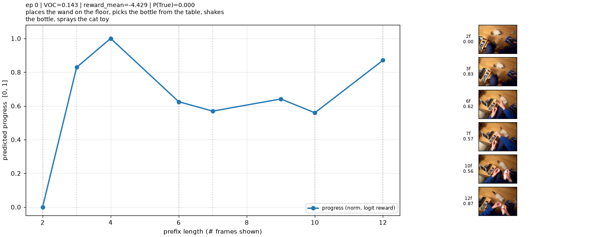

# Ego4D TOPReward Experiments

Compute [TOPReward](https://topreward.github.io/webpage/)-style rewards for
[Ego4D manipulation clips](https://huggingface.co/datasets/mderry/ego4d-manipulation-v1)
using Qwen3-VL or Molmo2. This repo runs independently of the upstream TOPReward package.

- **Reward:** log probability of the caption and “True” answer span given video frames.
- **Progress:** rewards over clip prefixes, normalized to [0, 1].
- **VOC:** Spearman correlation of progress with time; higher means more consistently increasing progress.



*Example output: predicted progress and video keyframes for one Ego4D clip.*

## Quick start

Requires Python 3.11+, [uv](https://github.com/astral-sh/uv), and an NVIDIA GPU for inference.
Run from the repository directory:

```bash
uv sync
uv run python -m ego4d_toprewards.cli.run --model Qwen/Qwen3-VL-2B-Instruct --num-samples 10
```

For Molmo2, use `--model allenai/Molmo2-4B`. It loads custom model code with
`trust_remote_code=True`; attention falls back from flash-attention-2 to SDPA or eager.

Useful options:

- `--max-frames 12`: maximum sampled frames per clip.
- `--num-prefixes 8`: points in each progress curve.
- `--out FILE`: override the JSONL output path.
- `--plots-dir DIR`: override the plot directory; `--plots-dir ''` disables plots.
- `--cache-dir DIR`: override the dataset cache. Otherwise, standard Hugging Face cache settings apply; `HF_HOME` sets the cache root.

## Subgoals and comparison

`--split-subgoals` splits comma-separated actions and scores each over the **entire
clip**; the dataset provides no per-action frame boundaries.

```bash
uv run python -m ego4d_toprewards.cli.run --model Qwen/Qwen3-VL-2B-Instruct --num-samples 10 --split-subgoals
uv run python -m ego4d_toprewards.cli.videos --jsonl runs/Qwen_Qwen3-VL-2B-Instruct_subgoals/topreward.jsonl
uv run python -m ego4d_toprewards.cli.compare --runs-dir runs
```

Video rendering runs on CPU and writes synchronized MP4s beside the JSONL in
`videos/` (`--out-dir` overrides this). Comparison uses whole-episode runs and
writes summary JSON, VOC bars, and progress-curve overlays.

## Outputs

By default, files go to `runs/<model-tag>/` (model ID with `/` replaced by `_`),
with `_subgoals` appended in subgoal mode:

- `topreward.jsonl`: per-episode scores, token log probabilities, progress, and VOC.
- `topreward.summary.json`: aggregate statistics and error counts.
- `plots/`: progress/keyframe plots; subgoal mode adds per-action plots and episode overlays.

## Layout

```text
ego4d_toprewards/
  core.py       # dataset loading, scoring, plots, and run orchestration
  cli/
    run.py      # experiment command
    compare.py  # model comparison
    videos.py   # subgoal video rendering
tests/          # offline smoke test
runs/           # experiment outputs
```

## Smoke test

```bash
uv run pytest -q tests/test_smoke.py
```

Tests scoring, both run modes, output files, plots, comparison, and MP4 encoding
with synthetic frames and a tiny PyTorch model. No dataset or weights are downloaded.
Use `--help` on any script for all options.
